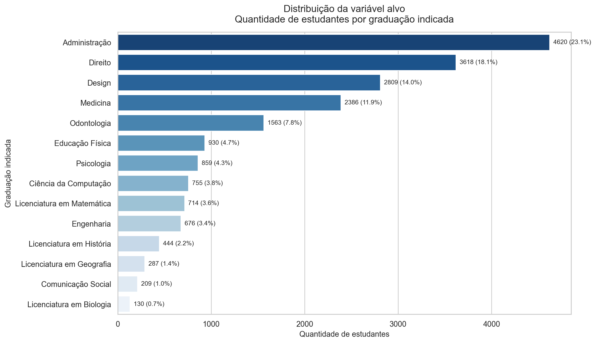
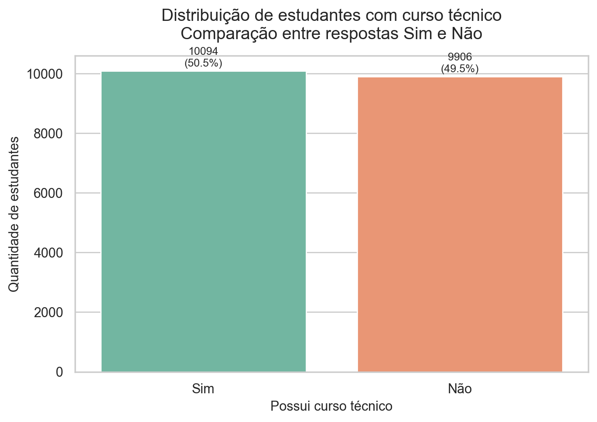
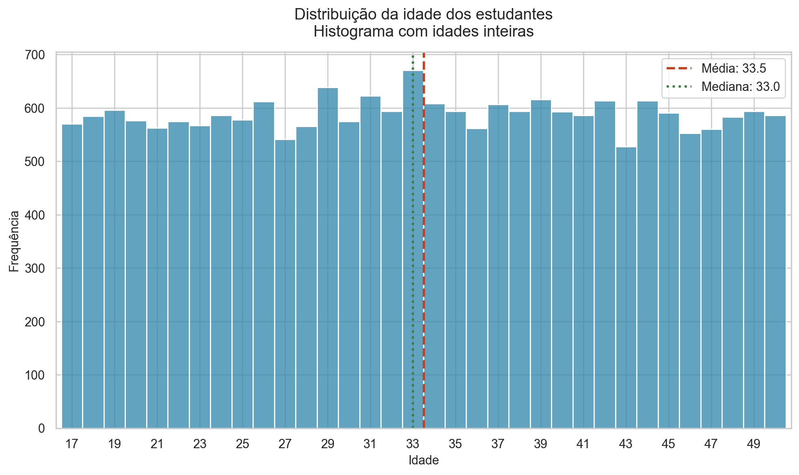
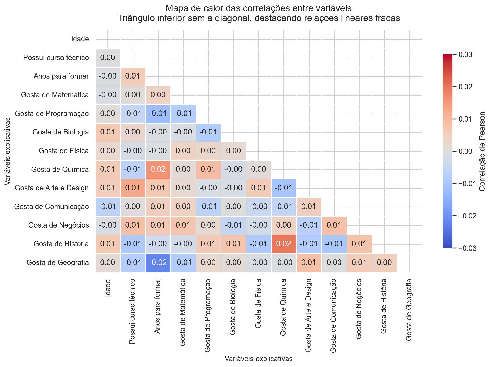
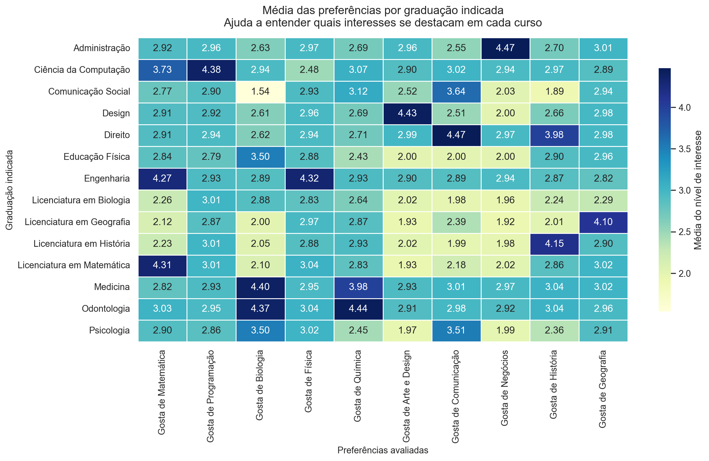

# Relatório de EDA

## Visão geral do dataset
- Arquivo de origem: `data/dataset_graduacao_indicada.csv`
- Linhas: `20000`
- Colunas: `14`
- Coluna alvo: `Graduacao_Indicada`
- Número de classes: `14`

## Qualidade dos dados
### Tipos das colunas
| índice | tipo |
| --- | --- |
| Idade | int64 |
| Curso_Tecnico | object |
| Anos_Para_Formar | int64 |
| Gosta_Matematica | int64 |
| Gosta_Programacao | int64 |
| Gosta_Biologia | int64 |
| Gosta_Fisica | int64 |
| Gosta_Quimica | int64 |
| Gosta_Arte_Design | int64 |
| Gosta_Comunicacao | int64 |
| Gosta_Negocios | int64 |
| Gosta_Historia | int64 |
| Gosta_Geografia | int64 |
| Graduacao_Indicada | object |

### Valores nulos
| índice | quantidade_nulos |
| --- | --- |
| Idade | 0 |
| Curso_Tecnico | 0 |
| Anos_Para_Formar | 0 |
| Gosta_Matematica | 0 |
| Gosta_Programacao | 0 |
| Gosta_Biologia | 0 |
| Gosta_Fisica | 0 |
| Gosta_Quimica | 0 |
| Gosta_Arte_Design | 0 |
| Gosta_Comunicacao | 0 |
| Gosta_Negocios | 0 |
| Gosta_Historia | 0 |
| Gosta_Geografia | 0 |
| Graduacao_Indicada | 0 |

- Linhas duplicadas: `0`

## Estatísticas descritivas
| índice | Idade | Anos_Para_Formar | Gosta_Matematica | Gosta_Programacao | Gosta_Biologia | Gosta_Fisica | Gosta_Quimica | Gosta_Arte_Design | Gosta_Comunicacao | Gosta_Negocios | Gosta_Historia | Gosta_Geografia |
| --- | --- | --- | --- | --- | --- | --- | --- | --- | --- | --- | --- | --- |
| count | 20000.0 | 20000.0 | 20000.0 | 20000.0 | 20000.0 | 20000.0 | 20000.0 | 20000.0 | 20000.0 | 20000.0 | 20000.0 | 20000.0 |
| mean | 33.52 | 5.0 | 3.0 | 2.99 | 3.02 | 2.99 | 3.0 | 2.99 | 3.0 | 3.0 | 3.02 | 2.99 |
| std | 9.75 | 1.41 | 1.42 | 1.42 | 1.41 | 1.41 | 1.42 | 1.41 | 1.41 | 1.41 | 1.42 | 1.41 |
| min | 17.0 | 3.0 | 1.0 | 1.0 | 1.0 | 1.0 | 1.0 | 1.0 | 1.0 | 1.0 | 1.0 | 1.0 |
| 25% | 25.0 | 4.0 | 2.0 | 2.0 | 2.0 | 2.0 | 2.0 | 2.0 | 2.0 | 2.0 | 2.0 | 2.0 |
| 50% | 33.0 | 5.0 | 3.0 | 3.0 | 3.0 | 3.0 | 3.0 | 3.0 | 3.0 | 3.0 | 3.0 | 3.0 |
| 75% | 42.0 | 6.0 | 4.0 | 4.0 | 4.0 | 4.0 | 4.0 | 4.0 | 4.0 | 4.0 | 4.0 | 4.0 |
| max | 50.0 | 7.0 | 5.0 | 5.0 | 5.0 | 5.0 | 5.0 | 5.0 | 5.0 | 5.0 | 5.0 | 5.0 |

## Distribuição da variável alvo
| Graduacao_Indicada | quantidade | porcentagem |
| --- | --- | --- |
| Administração | 4620 | 23.1 |
| Direito | 3618 | 18.09 |
| Design | 2809 | 14.04 |
| Medicina | 2386 | 11.93 |
| Odontologia | 1563 | 7.82 |
| Educação Física | 930 | 4.65 |
| Psicologia | 859 | 4.3 |
| Ciência da Computação | 755 | 3.78 |
| Licenciatura em Matemática | 714 | 3.57 |
| Engenharia | 676 | 3.38 |
| Licenciatura em História | 444 | 2.22 |
| Licenciatura em Geografia | 287 | 1.44 |
| Comunicação Social | 209 | 1.04 |
| Licenciatura em Biologia | 130 | 0.65 |

## Distribuição de Curso_Tecnico
| Curso_Tecnico | quantidade | porcentagem |
| --- | --- | --- |
| Sim | 10094 | 50.47 |
| Não | 9906 | 49.53 |

## Distribuição de idade
A idade apresenta distribuição bem espalhada entre 17 e 50 anos, sem concentração extrema em uma faixa específica.

## Correlação entre features
Para calcular a correlação, a variável categórica `Curso_Tecnico` foi convertida para valores binários (`Sim` = 1 e `Não` = 0).

| índice | Idade | Curso_Tecnico | Anos_Para_Formar | Gosta_Matematica | Gosta_Programacao | Gosta_Biologia | Gosta_Fisica | Gosta_Quimica | Gosta_Arte_Design | Gosta_Comunicacao | Gosta_Negocios | Gosta_Historia | Gosta_Geografia |
| --- | --- | --- | --- | --- | --- | --- | --- | --- | --- | --- | --- | --- | --- |
| Idade | 1.0 | 0.0 | -0.0 | -0.001 | 0.0 | 0.007 | 0.003 | 0.006 | 0.005 | -0.007 | -0.001 | 0.007 | 0.002 |
| Curso_Tecnico | 0.0 | 1.0 | 0.006 | 0.001 | -0.005 | 0.003 | -0.002 | -0.007 | 0.013 | 0.0 | 0.008 | -0.009 | -0.008 |
| Anos_Para_Formar | -0.0 | 0.006 | 1.0 | 0.004 | -0.012 | -0.001 | -0.0 | 0.016 | 0.007 | 0.005 | 0.007 | -0.003 | -0.022 |
| Gosta_Matematica | -0.001 | 0.001 | 0.004 | 1.0 | -0.008 | -0.001 | 0.004 | 0.001 | 0.002 | 0.004 | 0.007 | -0.002 | -0.009 |
| Gosta_Programacao | 0.0 | -0.005 | -0.012 | -0.008 | 1.0 | -0.008 | 0.003 | 0.009 | -0.001 | -0.007 | 0.002 | 0.006 | 0.002 |
| Gosta_Biologia | 0.007 | 0.003 | -0.001 | -0.001 | -0.008 | 1.0 | 0.002 | -0.002 | -0.001 | 0.0 | -0.005 | 0.008 | 0.001 |
| Gosta_Fisica | 0.003 | -0.002 | -0.0 | 0.004 | 0.003 | 0.002 | 1.0 | 0.001 | 0.006 | -0.004 | -0.002 | -0.01 | -0.001 |
| Gosta_Quimica | 0.006 | -0.007 | 0.016 | 0.001 | 0.009 | -0.002 | 0.001 | 1.0 | -0.011 | -0.006 | 0.004 | 0.019 | -0.001 |
| Gosta_Arte_Design | 0.005 | 0.013 | 0.007 | 0.002 | -0.001 | -0.001 | 0.006 | -0.011 | 1.0 | 0.005 | -0.007 | -0.009 | 0.008 |
| Gosta_Comunicacao | -0.007 | 0.0 | 0.005 | 0.004 | -0.007 | 0.0 | -0.004 | -0.006 | 0.005 | 1.0 | 0.008 | -0.01 | 0.0 |
| Gosta_Negocios | -0.001 | 0.008 | 0.007 | 0.007 | 0.002 | -0.005 | -0.002 | 0.004 | -0.007 | 0.008 | 1.0 | 0.008 | 0.006 |
| Gosta_Historia | 0.007 | -0.009 | -0.003 | -0.002 | 0.006 | 0.008 | -0.01 | 0.019 | -0.009 | -0.01 | 0.008 | 1.0 | 0.005 |
| Gosta_Geografia | 0.002 | -0.008 | -0.022 | -0.009 | 0.002 | 0.001 | -0.001 | -0.001 | 0.008 | 0.0 | 0.006 | 0.005 | 1.0 |

## Média das preferências por alvo
| Graduacao_Indicada | Gosta_Matematica | Gosta_Programacao | Gosta_Biologia | Gosta_Fisica | Gosta_Quimica | Gosta_Arte_Design | Gosta_Comunicacao | Gosta_Negocios | Gosta_Historia | Gosta_Geografia |
| --- | --- | --- | --- | --- | --- | --- | --- | --- | --- | --- |
| Administração | 2.92 | 2.96 | 2.63 | 2.97 | 2.69 | 2.96 | 2.55 | 4.47 | 2.7 | 3.01 |
| Ciência da Computação | 3.73 | 4.38 | 2.94 | 2.48 | 3.07 | 2.9 | 3.02 | 2.94 | 2.97 | 2.89 |
| Comunicação Social | 2.77 | 2.9 | 1.54 | 2.93 | 3.12 | 2.52 | 3.64 | 2.03 | 1.89 | 2.94 |
| Design | 2.91 | 2.92 | 2.61 | 2.96 | 2.69 | 4.43 | 2.51 | 2.0 | 2.66 | 2.98 |
| Direito | 2.91 | 2.94 | 2.62 | 2.94 | 2.71 | 2.99 | 4.47 | 2.97 | 3.98 | 2.98 |
| Educação Física | 2.84 | 2.79 | 3.5 | 2.88 | 2.43 | 2.0 | 2.0 | 2.0 | 2.9 | 2.96 |
| Engenharia | 4.27 | 2.93 | 2.89 | 4.32 | 2.93 | 2.9 | 2.89 | 2.94 | 2.87 | 2.82 |
| Licenciatura em Biologia | 2.26 | 3.01 | 2.88 | 2.83 | 2.64 | 2.02 | 1.98 | 1.96 | 2.24 | 2.29 |
| Licenciatura em Geografia | 2.12 | 2.87 | 2.0 | 2.97 | 2.87 | 1.93 | 2.39 | 1.92 | 2.01 | 4.1 |
| Licenciatura em História | 2.23 | 3.01 | 2.05 | 2.88 | 2.93 | 2.02 | 1.99 | 1.98 | 4.15 | 2.9 |
| Licenciatura em Matemática | 4.31 | 3.01 | 2.1 | 3.04 | 2.83 | 1.93 | 2.18 | 2.02 | 2.86 | 3.02 |
| Medicina | 2.82 | 2.93 | 4.4 | 2.95 | 3.98 | 2.93 | 3.01 | 2.97 | 3.04 | 3.02 |
| Odontologia | 3.03 | 2.95 | 4.37 | 3.04 | 4.44 | 2.91 | 2.98 | 2.92 | 3.04 | 2.96 |
| Psicologia | 2.9 | 2.86 | 3.5 | 3.02 | 2.45 | 1.97 | 3.51 | 1.99 | 2.36 | 2.91 |

## Top 5 classes da variável alvo
| Graduacao_Indicada | quantidade | porcentagem |
| --- | --- | --- |
| Administração | 4620 | 23.1 |
| Direito | 3618 | 18.09 |
| Design | 2809 | 14.04 |
| Medicina | 2386 | 11.93 |
| Odontologia | 1563 | 7.82 |

## Insights
1. O dataset está limpo para modelagem: não foram encontrados valores nulos nem linhas duplicadas nas 20.000 observações.
2. A variável alvo está desbalanceada. Administração representa 23,10% da base, enquanto Licenciatura em Biologia representa apenas 0,65%.
3. A correlação linear entre as features é muito fraca no geral, o que sugere baixa multicolinearidade. Em valor absoluto, o par mais forte foi Anos_Para_Formar x Gosta_Geografia: correlação -0,022 (valor absoluto 0,022).
4. As variáveis de preferência parecem informativas para o alvo: Engenharia e Licenciatura em Matemática apresentam médias altas em matemática/física, Medicina e Odontologia se destacam em biologia/química, e Direito/Administração concentram maior afinidade com comunicação ou negócios.
5. As distribuições das variáveis numéricas são bastante regulares, com médias próximas ao centro da escala e frequências semelhantes entre categorias, o que sugere uma base mais controlada do que dados reais de produção.

## Conclusão
O dataset está pronto para a próxima etapa do pipeline. O principal ponto de atenção para a modelagem é o desbalanceamento da variável alvo. Além disso, como a base apresenta comportamento bastante regular, é importante interpretar os resultados com cautela e validar o desempenho do modelo antes de tirar conclusões mais fortes.
